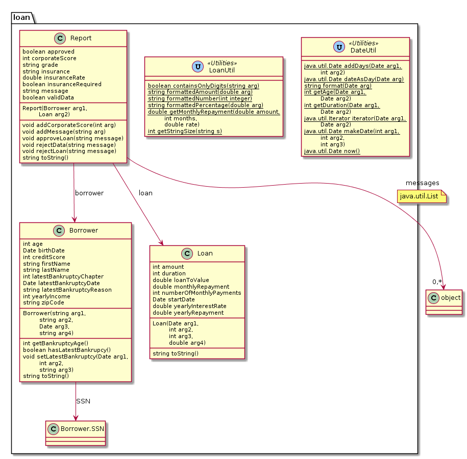

# decisions-uml-diagrammer
A repository to produce UML diagrams from [IBM ODM](https://www.ibm.com/support/knowledgecenter/SSQP76_8.9.2/welcome/kc_welcome_odmV.html) Rules or IBM ODM DSI artifacts

The generation of UML diagram is using [PlantUML](http://plantuml.com/).
In this first version, the code herein is only producing 
a textual description that can be passed to PlantUML to produce a diagram.

## Class diagram from a Business Object Model (BOM)

Here is an example of a class diagram of the Loan Validation sample BOM.


The ClassDiagramWriter class can produce a textual representation of a BOM
 to be passed to PlantUML to produce the actual class diagram. It can be 
 used with a BOM coming from ODM Rules or ODM DSI.
It has a specific representation for:
- utility classes (U)
- event classes (E)
- entity classes (N)

## How to get a diagram

### Setting up and Building the project

Clone this git reposiitory `git clone https://github.com/ODMDev/decisions-uml-diagrammer.git`

Before trying to build, you should set the ODM_HOME_DIRECTORY environment variable
to point to your IBM ODM installation directory.

Then run `mvn install`

### Command line interface
You may call

```
mvn exec:java -Dexec.args="-bom src/test/resources/com/ibm/decisions/uml/classdiagram/dsi-creditcard.bom"
```
The '**-bom**' argument should be followed by the name of a BOM file. If no '-bom' argument is being passed, then the
standard input will be used as the BOM.

There is also a '**-output**' option to pass the name of the output file. If no output is provided, the standard output
will be used to display the textual description of the UML diagram.

This textual description can be copied on the PlantUML server to obtain an image.

A future version of this project will include the PlantUML server as a Docker image.

# License
[Apache 2.0](LICENSE)

# Notice
© Copyright IBM Corporation 2018.